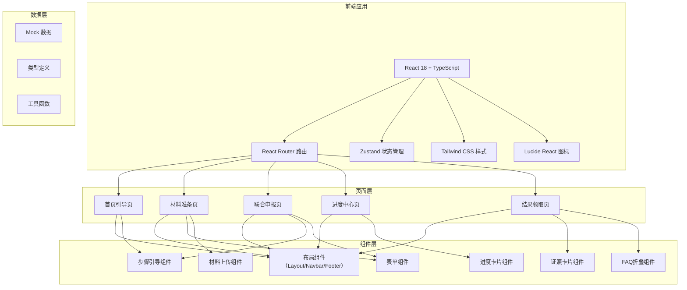

## 1. 架构设计



## 2. 技术描述

- **前端框架**：React 18 + TypeScript
- **构建工具**：Vite 5
- **路由管理**：React Router DOM 6
- **状态管理**：Zustand 4
- **样式方案**：Tailwind CSS 3
- **图标库**：Lucide React
- **后端**：无（纯前端 Mock 数据演示）
- **数据**：本地 Mock 数据模拟政务服务场景

## 3. 路由定义
| 路由 | 页面 | 用途 |
|------|------|------|
| / | 首页引导 | 智能分流入口、流程概览 |
| /materials | 材料准备 | 条件自检、材料清单 |
| /apply | 联合申报 | 信息填写、身份核验、提交 |
| /progress | 进度中心 | 跨部门进度、补正意见 |
| /result | 结果领取 | 电子证照、常见问题 |

## 4. 数据模型

### 4.1 类型定义

```typescript
// 用户信息
interface UserInfo {
  id: string;
  name: string;
  idCard: string;
  phone: string;
  relation: 'father' | 'mother' | 'guardian';
}

// 新生儿信息
interface BabyInfo {
  name: string;
  gender: 'male' | 'female';
  birthDate: string;
  birthTime: string;
  birthPlace: string;
  hospital: string;
  healthStatus: string;
}

// 申报事项
interface ApplicationItem {
  id: string;
  name: string;
  department: string;
  status: 'pending' | 'processing' | 'completed' | 'rejected';
  estimatedTime: string;
  actualTime?: string;
  remarks?: string;
}

// 材料清单
interface MaterialItem {
  id: string;
  name: string;
  required: boolean;
  description: string;
  uploaded: boolean;
  uploadUrl?: string;
}

// 补正意见
interface CorrectionNotice {
  id: string;
  itemId: string;
  itemName: string;
  content: string;
  deadline: string;
  resolved: boolean;
}

// 电子证照
interface ECertificate {
  id: string;
  type: string;
  name: string;
  number: string;
  issueDate: string;
  issueAuthority: string;
  validUntil: string;
  status: 'active' | 'pending';
}

// 常见问题
interface FAQ {
  id: string;
  category: string;
  question: string;
  answer: string;
}
```

### 4.2 状态管理

使用 Zustand 管理全局状态：
- `applicationStore`：申报流程状态（分流结果、表单数据、提交状态）
- `progressStore`：进度查询状态（事项列表、补正通知、预警信息）
- `userStore`：用户信息状态

## 5. 项目结构

```
src/
├── components/        # 公共组件
│   ├── Layout/       # 布局组件
│   ├── Steps/        # 步骤引导
│   ├── Form/         # 表单组件
│   ├── Progress/     # 进度组件
│   ├── Certificate/  # 证照组件
│   └── FAQ/          # FAQ组件
├── pages/            # 页面组件
│   ├── Home.tsx
│   ├── Materials.tsx
│   ├── Apply.tsx
│   ├── Progress.tsx
│   └── Result.tsx
├── store/            # 状态管理
│   ├── application.ts
│   ├── progress.ts
│   └── user.ts
├── data/             # Mock数据
│   ├── mockData.ts
│   └── faqData.ts
├── types/            # 类型定义
│   └── index.ts
├── utils/            # 工具函数
│   └── helpers.ts
├── App.tsx
├── main.tsx
└── index.css
```
